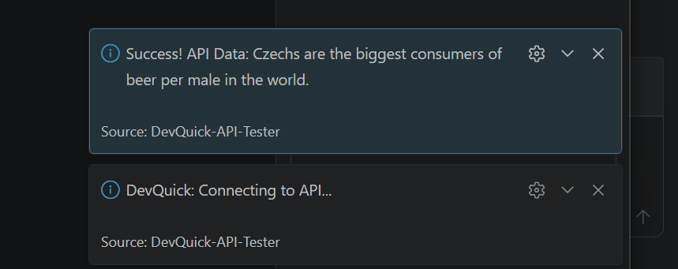

# DevQuick 🚀

**Test APIs without leaving your editor.**

DevQuick is a VS Code extension built with TypeScript and Axios. It solves the "context-switching" problem by allowing developers to trigger REST API calls directly from the Command Palette.

### 🌟 Features
- **Instant Connection:** Fetches real-time data using Axios.
- **Async/Await Logic:** Demonstrates non-blocking I/O operations in TypeScript.
- **Lightweight:** Minimal footprint, designed for high-speed testing.

### 🛠️ Tech Stack
- **Language:** TypeScript
- **Runtime:** Node.js
- **API:** REST / uslessfacts API

